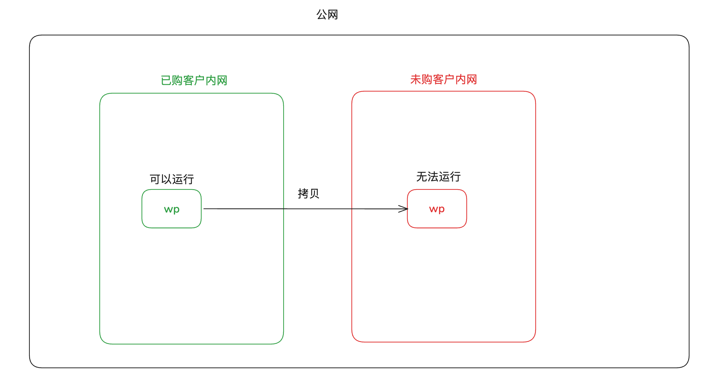
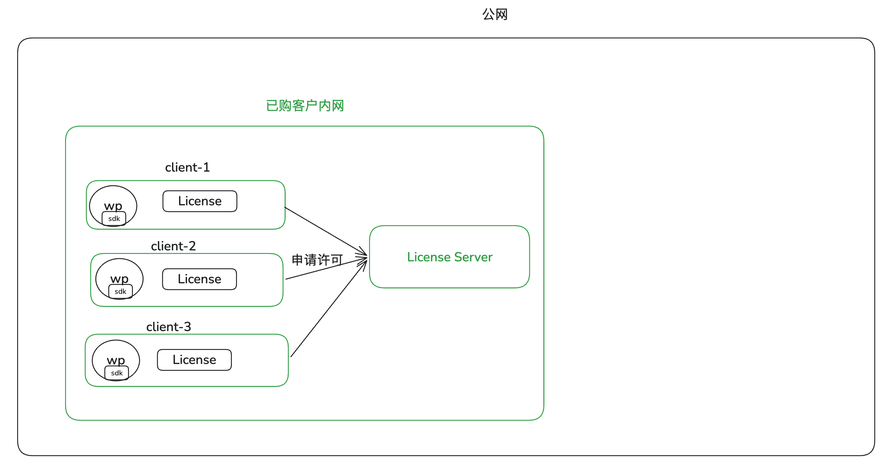
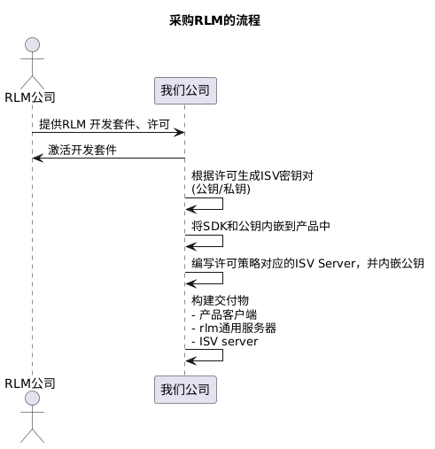
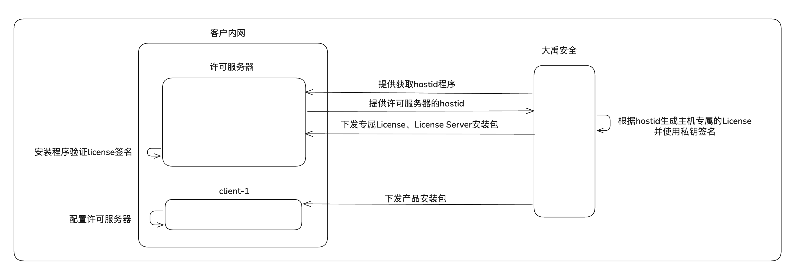
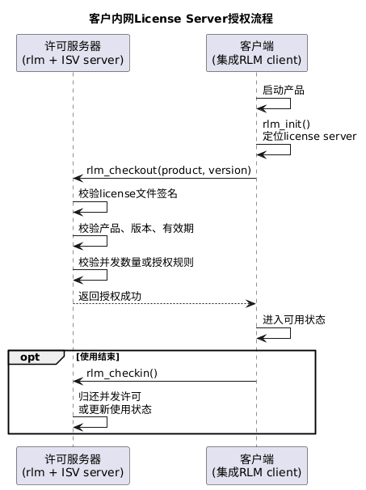

## RLM是什么
是一种离线软件常用的 License 授权管理系统。

## 他解决什么问题
1. 当软件交付到一个完全隔离的内网环境下，如何保证不被未购买的客户使用。

### RLM能做哪些认证
许可证类型有：
- 节点：仅在指定节点上运行（卖给单人）
    - 单机单实例
    - 单机任意实例
    - 单机计数
- 浮动：可在网络上的任何位置使用，最多可以有n个设备并发使用。（通常是卖给公司）
    - 浮动计数许可
    - 浮动角色共享许可
- 基于token或包：依赖于一个主许可，每次消耗主许可额度，有点像AI的使用额度。
- 计数：执行次数限制或执行时间限制.

## 基本流程
### 核心组件
下面是比较常见的一种部署方式，但是根据不同的许可类型，以下结构不一定相同。

- 客户端依赖库: 关键代码以二进制+头文件的方式 链接到我们产品中的，
- 许可证服务器: 由两部分组成，该服务一般部署在客户侧
    - RLM通用服务:控制许可证的分配、跟踪许可证的数量。
    - ISV服务：根据我们需求和RLM套件定制的服务。
- 许可文件
> 为什么依赖库是二进制:如果是源码，用户就可以根据源码模拟一个License Server进行授权。

### 几个关键术语
- ISV：独立软件供应商（我们公司）。
- license：对某产品的使用权描述（最终落在license file里）。
- checkout / checkin：申请/占用许可 与 归还许可。
- hostid：被绑定的机器标识。

### 我们使用RLM流程

### 客户购买我们产品的流程
以浮动型许可举例：

### License Server 授权流程
